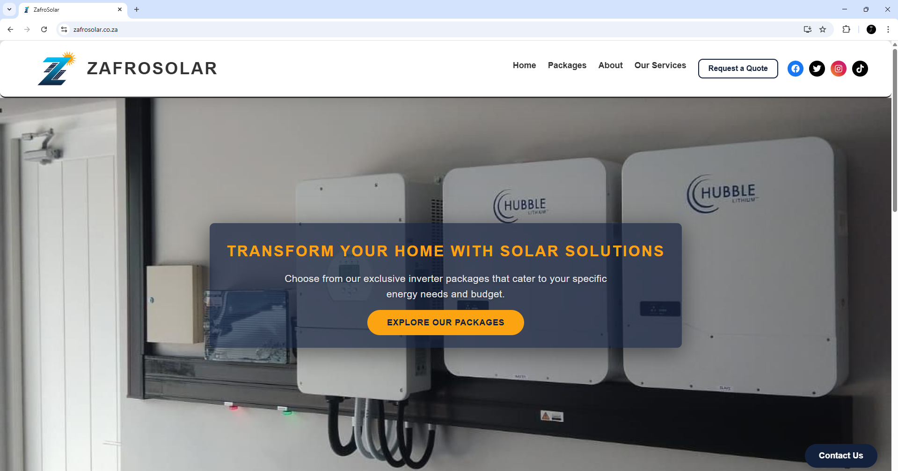
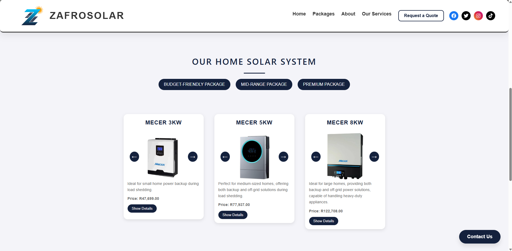
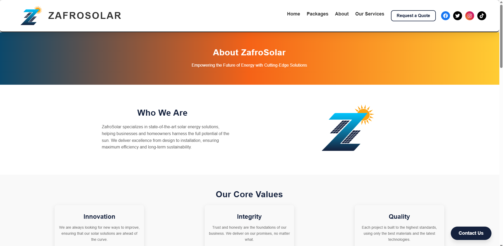
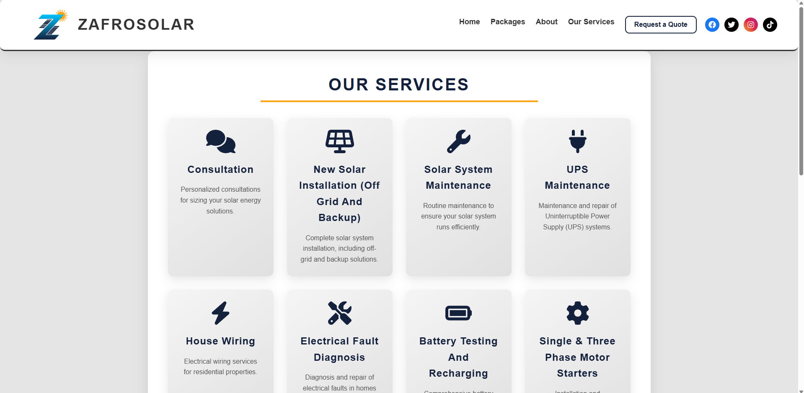
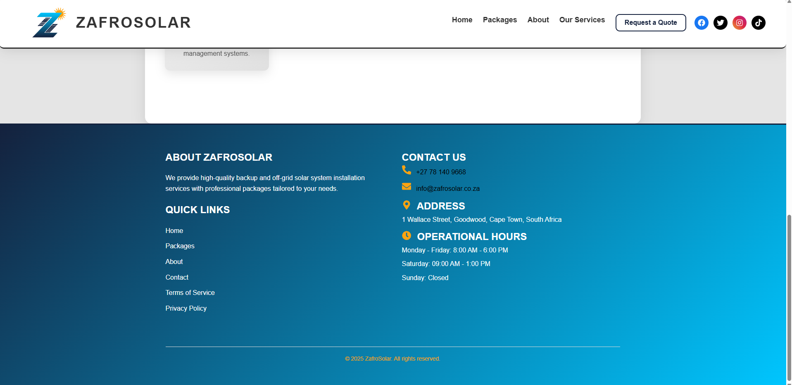
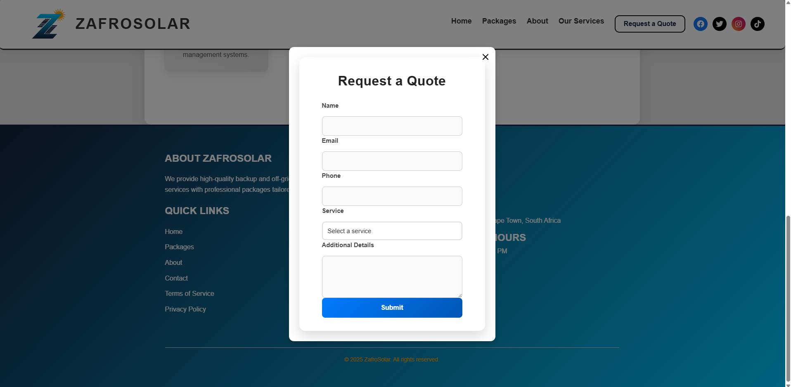

# Zafrosolar - Solar Energy Solutions

-**THIS APPLICATION WAS CREATED FOR A CLIENT.**  
-**SCREENSHOTS PROVIDED!**

Welcome to Zafrosolar, your one-stop solution for transforming your home with cutting-edge solar energy technology. We provide a range of solar inverter packages tailored to fit your energy needs and boost your home's energy efficiency.

## 🌞 About The Project

Zafrosolar offers smart and sustainable solutions to reduce your energy costs and minimize your carbon footprint. Whether you're looking for a single inverter or a full solar panel system, our expertly designed packages will help you make the most out of solar energy.

### 🚀 Key Features:

- **Solar Inverter Packages** – Choose from a variety of pre-configured packages based on your power needs.
- **Energy Efficiency** – Designed to help you maximize energy savings and reduce reliance on traditional electricity sources.
- **Easy Navigation** – Browse through packages, compare features, and easily find the best solution for your home.
- **Sleek Design** – A modern and user-friendly interface that makes the decision process smoother.

## 🛠️ Technologies Used

- **Frontend**: React.js, HTML, CSS
- **Backend**: formfree API
- **Version Control**: Git, GitHub

## 📄 License

This project is licensed under the MIT License - see the [LICENSE](LICENSE) file for details.

---

### 🖋️ See The Site in Action
- Website: [zafrosolar.co.za](https://www.zafrosolar.co.za)

## Home

## Packages

## About

## Services

## Footer

## Form

---

**Zafrosolar** - Empowering homes with clean, renewable energy.
